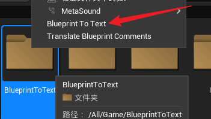
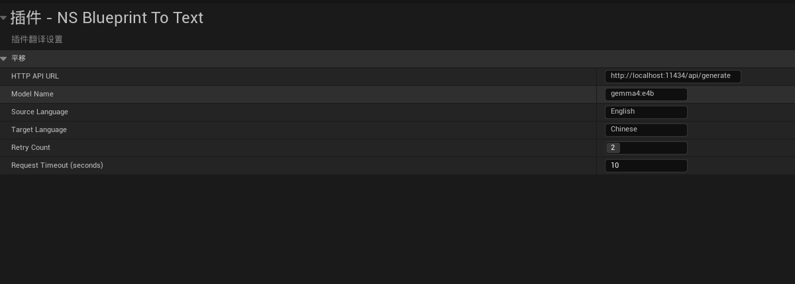
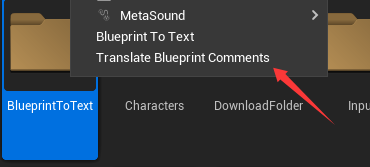
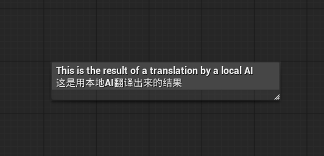

# NS_BlueprintToText

## Plugin Overview

NS_BlueprintToText is a plugin designed to quickly understand project content, providing two core features:

1. **Blueprint to Text**: Export blueprint assets to AI-readable text format for easy analysis and understanding with AI tools
2. **Batch Translation**: Quickly translate blueprint comments using local large language models (Ollama, llama.cpp, etc.)

## Key Features

- 🔄 Support for multiple asset types: Blueprints, Animation Blueprints, Data Tables
- 📝 Extract complete blueprint structure: Components, Variables, Functions, Nodes, Comments
- 🌐 Batch translate blueprint comments for folders and selected assets
- 🤖 Compatible with local AI models (Ollama, llama.cpp, etc.)
- ⚡ Smart retry mechanism for stable translation
- 📦 Export to plain text format, easy for AI processing


## Feature Details

### 1. Blueprint to Text

Export blueprint assets to text format, extracting the following content:
Components, Variables, Functions, Node Information, Comments, Collapsed Nodes


#### How to Use
1. Right-click a folder or individual blueprint file in the Content Browser
2. Select **`Blueprint To Text`**
3. The plugin will automatically process all blueprint assets in the folder




#### Export Results

Exported text files are saved in: `Content/BlueprintToText/` with `.txt` file format

### 2. Batch Translate Comments

Use local large language models to batch translate comments in blueprints, supporting multiple language pairs.

#### Configure Translation Settings

1. Open **Edit > Project Settings**
2. Find **Plugins > NS Blueprint To Text**
3. Configure the following parameters:



**Configuration Options:**

| Option | Description | Default Value |
|--------|-------------|---------------|
| HTTP API URL | API address of the translation service | `http://localhost:11434/api/generate` |
| Model Name | Name of the model to use | `gemma4:e4b` |
| Source Language | Source language | `English` |
| Target Language | Target language | `Chinese` |
| Retry Count | Number of retries on request failure | `2` |
| Request Timeout | Request timeout in seconds | `10` |

#### How to Use

1. Right-click a folder or individual blueprint file in the Content Browser
2. Select **Translate Blueprint Comments**
3. The plugin will automatically translate comments in all blueprints in the folder




#### Translation Results

Translated comments are directly updated on blueprint nodes in the format:



#### Translation Features

- ✅ Auto-deduplication: Identical comments are translated only once
- ✅ Smart filtering: Skip comments with only numbers or symbols
- ✅ Sequential processing: Translate in order to avoid API overload
- ✅ Auto-retry: Automatically retry on network errors or timeouts
- ✅ Real-time notifications: Display translation progress and results

## Supported AI Models

The plugin is compatible with all local model services that support OpenAI-style APIs:

### Ollama

1. Install Ollama: https://ollama.ai/
2. Download model: `ollama pull gemma4:e4b`
3. Start service: `ollama serve`
4. Configure URL: `http://localhost:11434/api/generate`

### llama.cpp

1. Compile llama.cpp server
2. Start service: `./server -m model.gguf --port 8080`
3. Configure URL: `http://localhost:8080/completion`

### Other Compatible Services

Any service that supports the following JSON format can be used:

**Request Format:**
```json
{
  "model": "model-name",
  "prompt": "Text to translate",
  "stream": false
}
```

**Response Format:**
```json
{
  "response": "Translation result"
}
```

## Use Cases

### Case 1: AI-Assisted Blueprint Analysis

Export complex blueprints to text and use AI tools like ChatGPT or Claude for analysis:

1. Export blueprint to text
2. Copy text content to AI conversation
3. Ask AI about blueprint logic, optimization suggestions, etc.

### Case 2: Multilingual Team Collaboration

Quickly translate blueprint comments when team members use different languages:

1. Configure source and target languages
2. Batch translate all blueprints in the project
3. Team members can see bilingual comments

### Case 3: Documentation Generation

Export blueprint content for project documentation:

1. Export all blueprints to text
2. Use scripts or AI tools to generate documentation
3. Automate documentation update workflow

## Important Notes

1. **Translation Service**: Requires a local AI model service (e.g., Ollama) to be running
2. **Network Connection**: Ensure the editor can access the configured API address
3. **Model Selection**: Lightweight models are recommended for faster translation
4. **Blueprint Saving**: Blueprints are automatically marked as modified after translation, remember to save
5. **Large Batch Translation**: Be patient when translating many blueprints, the plugin processes them sequentially to avoid API overload

## FAQ

### Q: What if translation fails?

A: Check the following:
- Is the AI model service running properly?
- Is the API URL configured correctly?
- Is the network connection working?
- Check the output log for detailed error information

### Q: What blueprint types are supported?

A: The following types are supported:
- Blueprint
- Animation Blueprint
- Data Table

### Q: Where are the exported text files?

A: Exported files are saved in the project's `Content/BlueprintToText/` directory.


## Technical Support

- Plugin Version: 1.0
- Engine Version: Unreal Engine 5.6+
- Developer: NodeSmith

## Changelog

### v1.0 (Initial Release)

- ✅ Blueprint to Text feature
- ✅ Batch translate comments feature
- ✅ Support for Ollama and other local AI models
- ✅ Smart retry mechanism
- ✅ Folder and asset-level operations
