# NS_DS_Commander

## 插件简介

NS_DS_Commander 是一套完整的 **UE5 专用服务器（DS）调度与匹配系统** 的客户端插件部分。插件负责把 UE 端（玩家客户端 / DS 游戏服务器）接入 Go 编写的服务端集群，从而完成：

- 玩家匹配（按地图 / 地区 / 队伍人数 / 游戏模式分组）
- 服务器（房间）的查询、手动创建与关闭
- 玩家状态同步（大厅 / 游戏中）
- 大厅聊天与房间聊天
- DS 进程的注册、FPS 上报、自定义字段上报、可加入状态控制
- 服务端主动推送的通知、踢出、关停倒计时等事件

**模块信息**

<table class="ns-module-table">
  <thead>
    <tr><th>项目</th><th>值</th></tr>
  </thead>
  <tbody>
    <tr><td>模块名</td><td><code>NS_DS_Commander</code></td></tr>
    <tr><td>模块类型</td><td>Runtime</td></tr>
    <tr><td>依赖模块</td><td>Core、CoreUObject、Engine、WebSockets、Json、JsonUtilities</td></tr>
    <tr><td>引擎版本</td><td>Unreal Engine 5.5</td></tr>
    <tr><td>核心类</td><td><code>UNS_MatchmakingSubsystem</code>（GameInstance 子系统，蓝图显示名 <code>NS_Matchmaking Subsystem</code>）</td></tr>
    <tr><td>辅助类</td><td><code>UNS_JsonUtilsBlueprintLibrary</code>（JSON 工具函数库）</td></tr>
  </tbody>
</table>

## 系统架构

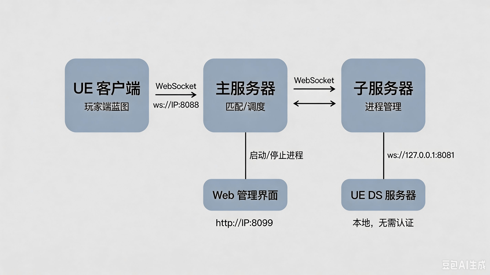

## 快速上手

### 玩家客户端接入流程

1. 在游戏实例蓝图中通过 `Get Subsystem` 获取 **NS_Matchmaking Subsystem**
2. 调用 **Connect To Server** 传入 WebSocket 地址与密码
3. 绑定需要的事件（`On Connection Success`、`On Match Result` 等，具体下面有节点介绍）
4. 在 `On Connection Success` 触发后调用 **Set Player Info** 设置玩家名与玩家ID
5. 调用 **Start Matchmaking** 开始匹配，在 `On Match Result` 中拿到服务器地址后 `Open Level` / `Client Travel` 进入

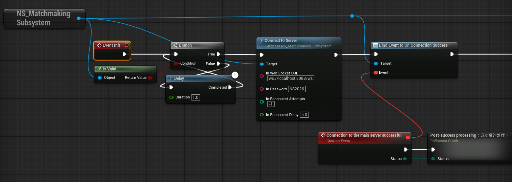

### DS 服务器接入流程

1. 在 DS 的 游戏模式 蓝图中获取 **NS_Matchmaking Subsystem**
2. 调用 **DS Connect To Child Server**，插件自动从命令行解析 `-port=` 并连接本机子服务器
3. 需要时调用 **DS Set Room Joinable Status** 控制房间是否允许新玩家加入
4. 调用 **DS Report Custom Fields Data** 上报业务自定义字段（JSON 字符串）
5. 绑定 `On DS Shutdown` 处理定时任务关停倒计时

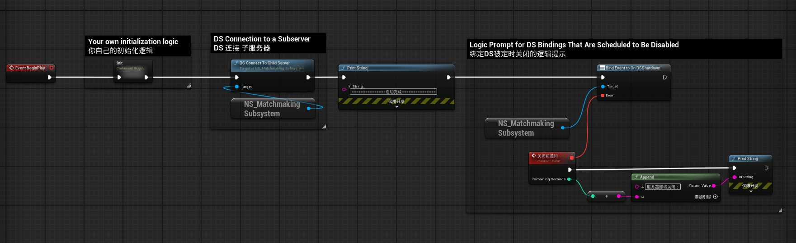

## 获取子系统

子系统是 `UGameInstanceSubsystem`，在整个游戏实例生命周期内唯一，且**跨关卡切换不会断开 WebSocket 连接**。

蓝图获取方式：

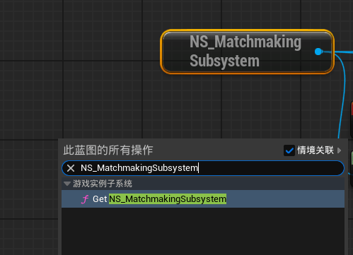

## 枚举与结构体

### EConnectionStatus

连接成功 / 玩家信息确认结果状态。

| 值 | 说明 |
|------|------|
| Normal | 正常连接成功 |
| Banned | 账号已被封禁（服务端返回 `banned=true` 时触发） |

---
### ERoomSourceType

房间来源类型，用于 `Get Room List` 过滤与 `Create Server` 指定来源。

| 值 | 服务端 `source_type` | 说明 |
|------|----------------------|------|
| Match | `match` | 匹配系统自动创建的房间 |
| System | `system` | 系统任务创建的房间 |
| Activity | `activity` | 活动创建的房间 |

---
### EChatType

聊天类型，用于 `Send Chat Message`。

| 值 | 说明 |
|------|------|
| Lobby | 大厅聊天，所有在线玩家可见 |
| Room | 房间聊天，仅当前房间内玩家可见 |

---
### FRoomInfo（房间信息）

`Get Room List` 回调返回的房间信息结构（只读）。

| 字段 | 类型 | 说明 |
|------|------|------|
| RoomName | String | 房间名称 |
| MapName | String | 地图名 |
| GameMode | String | 游戏模式 |
| Region | String | 地区 |
| ServerIP | String | 服务器 IP |
| Port | Integer | 服务器端口 |
| CurrentPlayers | Integer | 当前玩家数 |
| MaxPlayers | Integer | 最大玩家数 |
| TeamSize | Integer | 队伍人数 |
| bAllowJoin | Boolean | 是否允许新玩家加入 |
| bAllowMatch | Boolean | 是否允许被匹配搜索到（服务端未下发时默认 true） |
| SourceType | String | 来源类型：`match` / `system` / `activity` |
| PermissionTag | String | 权限标识（系统 / 活动房间可设置） |
| FPS | Float | DS 当前帧率 |

---
### FCreateServerParams（创建服务器参数）

`Create Server` 的入参，字段与 Web 管理端「手动创建服务器」对话框一致。

| 字段 | 类型 | 默认值 | 说明 |
|------|------|--------|------|
| Region | String | 空 | 地区（对应服务端 `create_server_config` 的 key，如 `Asia` / `NA` / `EU`） |
| RoomName | String | 空 | 房间名，留空则自动命名 |
| MapName | String | 空 | 地图名（必填） |
| GameMode | String | 空 | 游戏模式（必填） |
| TeamSize | Integer | 1 | 队伍人数（必须 ≥ 1） |
| bAllowMatch | Boolean | false | 是否允许该房间被匹配搜索到 |
| bUseIdleTimeout | Boolean | false | 是否启用房间空闲超时自动关闭（false 表示不受 `room_idle_timeout` 影响） |
| SourceType | ERoomSourceType | System | 来源类型，Match 由匹配系统专用，插件内部会防御性地映射为 System |
| PermissionTag | String | 空 | 权限标识，用于业务侧权限校验 |
| EndAfterDays | Integer | 0 | 结束天数（三项全为 0 表示无结束时间，不自动释放） |
| EndAfterHours | Integer | 0 | 结束小时数（≤ 23） |
| EndAfterMinutes | Integer | 0 | 结束分钟数（≤ 59） |
| NotifyBeforeMinutes | Integer | 0 | 结束前提前多少分钟通知 DS |

---
### FServerStats（服务器统计）

`Get Server Stats` 回调返回的统计信息（只读）。

| 字段 | 类型 | 说明 |
|------|------|------|
| LobbyPlayers | Integer | 大厅玩家数 |
| MatchingPlayers | Integer | 匹配中玩家数 |
| GamingPlayers | Integer | 游戏中玩家数 |
| TotalPlayers | Integer | 在线玩家总数 |
| ServerCount | Integer | 子服务器数量 |
| RoomCount | Integer | 房间数量 |

## 蓝图节点详解

节点按可用角色分为三类，代码内部有 `NetMode` 校验，角色不符时会直接无效返回：

- **【客户端】** 仅玩家客户端可调用，DS / 监听服务器调用无效
- **【DS】** 仅专用服务器可调用，客户端调用无效
- **【通用】** 客户端与 DS 均可调用

---

### 玩家端功能

#### Connect To Server【客户端】

连接到主服务器（匹配服务器）。会先把入参写入子系统的配置属性，再发起 WebSocket 连接；连接成功后自动发送认证消息（`client_type = player`）。

| 参数 | 类型 | 默认值 | 说明 |
|------|------|--------|------|
| InWebSocketURL | String | - | 主服务器 WebSocket 地址，如 `ws://127.0.0.1:8088/ws` |
| InPassword | String | - | 连接密码（插件内部 MD5 后发送） |
| InReconnectAttempts | Integer | -1 | 重连次数，-1 为无限重连 |
| InReconnectDelay | Float | 5.0 | 重连间隔（秒） |

**注意**

- DS / 监听服务器调用会直接返回并输出警告日志
- URL 为空时直接返回并输出错误日志
- 密码错误时服务端会断开连接，且**不会自动重连**（认证失败不重连）
- 连接成功后仍需调用 `Set Player Info`，`On Connection Success` 才会触发

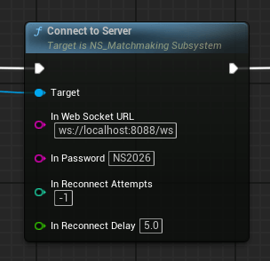

---

#### Disconnect【客户端】

断开 WebSocket 连接，并清除重连定时器。

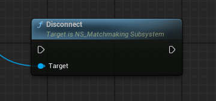

---

#### Is Connected【客户端】

查询当前是否已连接。

| 返回 | 类型 | 说明 |
|------|------|------|
| ReturnValue | Boolean | WebSocket 已连接 **且** 玩家信息已被服务端确认时返回 true |

> DS 端连接到子服务器后，不经过玩家信息确认，连接成功即为 true。

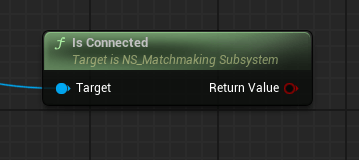

---

#### Start Matchmaking【客户端】

开始匹配。

| 参数 | 类型 | 默认值 | 说明 |
|------|------|--------|------|
| MapName | String | - | 地图名 |
| Region | String | - | 地区，如 `Asia` / `NA` / `EU` |
| TeamSize | Integer | 1 | 队伍人数 |
| GameMode | String | "1" | 游戏模式 |

**前置条件**：`Is Connected` 为 true、已调用过 `Set Player Info`、当前未在匹配中。

通过 `On Match Result` 接收结果；错误码为 `1` 时会保持匹配状态继续等待。

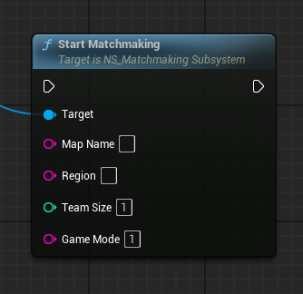

---

#### Cancel Matchmaking【客户端】

取消当前匹配。需在已连接且正在匹配中时调用。

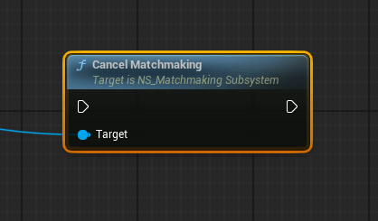

---

#### Is Matchmaking【客户端】

查询是否正在匹配中。

| 返回 | 类型 | 说明 |
|------|------|------|
| ReturnValue | Boolean | 是否已发起匹配且尚未结束 |

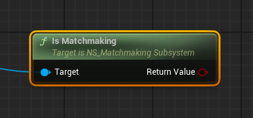

---

#### Set Player Info【客户端】

设置并提交玩家信息。服务端确认成功后才会触发 `On Connection Success`。

| 参数 | 类型 | 默认值 | 说明 |
|------|------|--------|------|
| InPlayerName | String | - | 玩家名（不能为空） |
| InPlayerID | String | - | 玩家唯一 ID（不能为空） |
| CustomData | String | 空 | 自定义数据，可选，原样透传给服务端 |

**注意**

- 必须在 WebSocket 已连接之后调用（此时 `Is Connected` 仍为 false 属于正常情况）
- 玩家名或 ID 为空时直接跳过并输出警告
- 重连成功后插件会自动补发玩家信息，无需重复调用

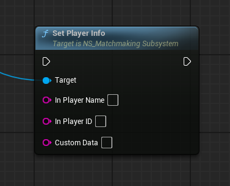

---

#### In Game【客户端】

通知服务端玩家已进入游戏（进入 DS 地图后调用）。

**前置条件**：已连接、玩家信息已设置、存在当前房间 ID（由 `On Match Result` 中的 `room_id` 自动记录）。

> 调用后会把当前房间与状态记录下来，断线重连时会自动恢复为「游戏中」状态。

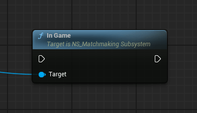

---

#### In Lobby【客户端】

通知服务端玩家已回到大厅（从 DS 返回大厅时调用）。

**注意**：若调用时尚未连接，插件会启动 1 秒间隔的重试，直到连接可用后自动发送。调用后会清空当前房间 ID。

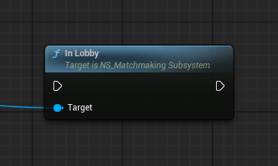

---

#### Send Custom Operate Reply【客户端】

回复服务端下发的「自定义操作」结果。需在收到携带 `request_id` 的 `On Message Notification` 之后调用。

| 参数 | 类型 | 说明 |
|------|------|------|
| Result | String | 处理结果字符串，业务自定义 |

**注意**：没有待处理的请求 ID 时会直接返回并输出错误日志；发送成功后请求 ID 会被清空。

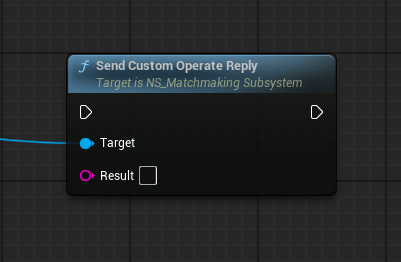

---

#### Send Chat Message【客户端】

发送聊天消息。

| 参数 | 类型 | 说明 |
|------|------|------|
| ChatType | EChatType | Lobby = 大厅聊天；Room = 房间聊天 |
| InPlayerName | String | 发送者名称（不能为空） |
| Content | String | 消息内容（不能为空） |

**注意**

- 存在 **0.5 秒** 发送间隔限流，过快调用会被丢弃并输出警告
- 房间聊天使用插件内部记录的当前房间 ID，未进入房间时发送可能无效

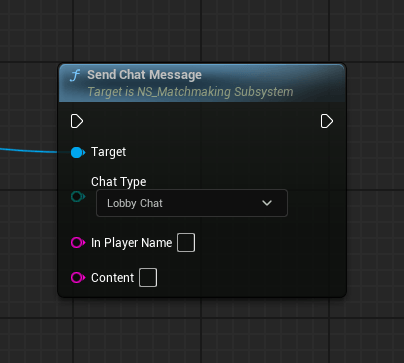

---

### DS 端功能

#### DS Connect To Child Server【DS】

DS 连接本机的子服务器。插件会自动从启动命令行解析 `-port=`（由子服务器分配并写入启动参数），连接 `ws://127.0.0.1:8081/ws`，无需认证，随后发送 `ds_register` 注册，并启动 **每 5 秒** 一次的 FPS 自动上报。

**注意**

- 仅 DS可调用，客户端调用无效
- 命令行缺少 `-port=` 时直接返回并输出错误日志
- 连接超时 5 秒；失败后最多重连 10 次，间隔 5 秒
- 端口解析结果会被后续 `Set Room Joinable Status` / `Report Custom Fields Data` / `DS Close Room` 复用

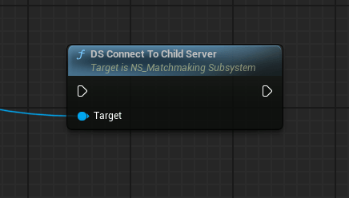

---

#### DS Set Room Joinable Status【DS】

设置当前房间是否允许新玩家加入（例如开局后闭房）。

| 参数 | 类型 | 说明 |
|------|------|------|
| bAllowJoin | Boolean | true = 允许加入；false = 禁止加入 |

**前置条件**：已连接子服务器且端口已解析成功。

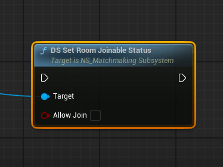

---

#### DS Report Custom Fields Data【DS】

上报业务自定义字段，数据会随房间信息同步到主服务器与 Web 管理端。

| 参数 | 类型 | 说明 |
|------|------|------|
| JsonData | String | JSON 格式字符串，如 `{"level":5,"mode":"rank"}` |

**注意**：JSON 解析失败时直接返回并输出错误日志；解析成功后会作为 `custom_fields` 对象嵌套发送。

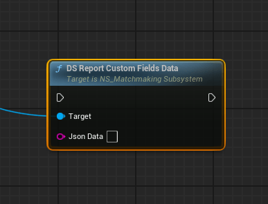

---

#### DS Close Room【DS】

DS 主动请求立即关闭当前房间（例如对局结束、对局异常、服务自检失败）。

**注意**：仅 `NM_DedicatedServer`（纯 DS）可调用，客户端调用无效。

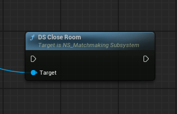

---

### 通用功能

#### Get Available Regions【通用】

获取可用地区列表，结果通过异步回调返回。插件会向主服务器实时请求最新列表，收到 `available_regions_response` 后通过回调返回结果。

| 参数 | 类型 | 说明 |
|------|------|------|
| OnComplete | 回调 | `bSuccess`(Boolean) + `Regions`(String 数组) |

**注意**

- 未连接时会立即以 `bSuccess = false` 和空数组回调，不会发起网络请求
- 内部通过 `request_id` 匹配回调，可安全地并发调用
- 连接确认成功后插件会自动从服务端拉取一次地区列表更新缓存（无回调），此时无需手动调用

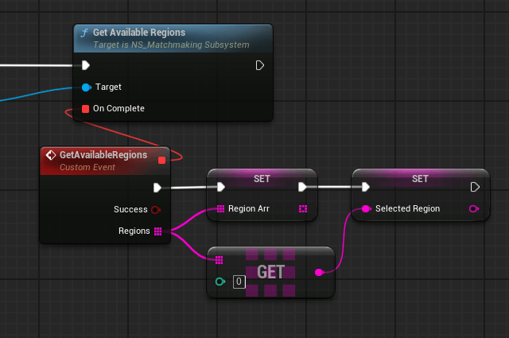

---

#### Get Room List【通用】

按来源类型获取房间列表，结果通过异步回调返回。

| 参数 | 类型 | 说明 |
|------|------|------|
| SourceType | ERoomSourceType | 过滤类型：Match / System / Activity |
| OnComplete | 回调 | `bSuccess`(Boolean) + `RoomList`(FRoomInfo 数组) |

**注意**

- 未连接时会立即以 `bSuccess = false` 和空数组回调，不会发起网络请求
- 内部通过 `request_id` 匹配回调，可安全地并发调用
- 服务端仅返回已分配端口（DS 已启动）的房间，并按创建时间倒序返回

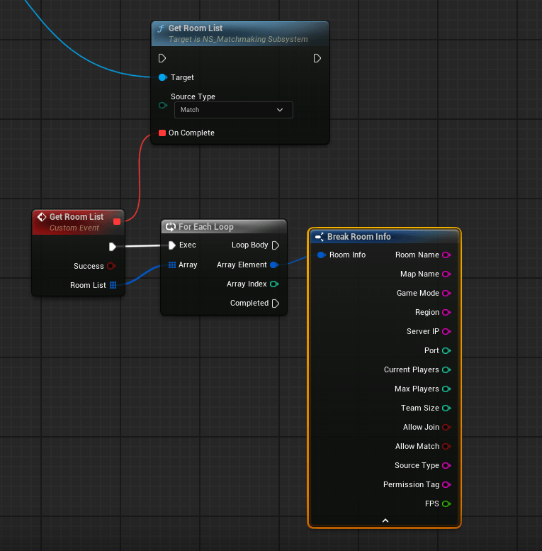

---

#### Get Server Stats【通用】

获取服务器集群统计信息，结果通过异步回调返回。

| 参数 | 类型 | 说明 |
|------|------|------|
| OnComplete | 回调 | `bSuccess`(Boolean) + `Stats`(FServerStats) |

未连接时会立即以 `bSuccess = false` 和零值统计回调。

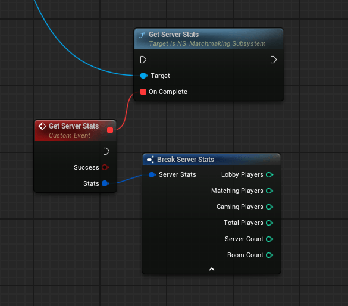

---

#### Create Server【通用】

手动创建一个服务器（房间），参数与 Web 管理端「手动创建服务器」一致，结果通过异步回调返回。

| 参数 | 类型 | 说明 |
|------|------|------|
| Params | FCreateServerParams | 创建参数（见结构体说明） |
| OnComplete | 回调 | `bSuccess`(Boolean) + `Message`(String) + `ErrorCode`(Integer) |

**服务端校验规则**

- `Region`、`MapName`、`GameMode` 不能为空
- `TeamSize` 必须 ≥ 1
- `EndAfterHours` ≤ 23，`EndAfterMinutes` ≤ 59，结束时间相关字段不能为负
- `NotifyBeforeMinutes` 不能为负

> 返回 `bSuccess = true` 表示**创建请求已被受理**（房间需要等待云服务器创建 / DS 启动），可在随后用 `Get Room List` 轮询房间是否就绪。

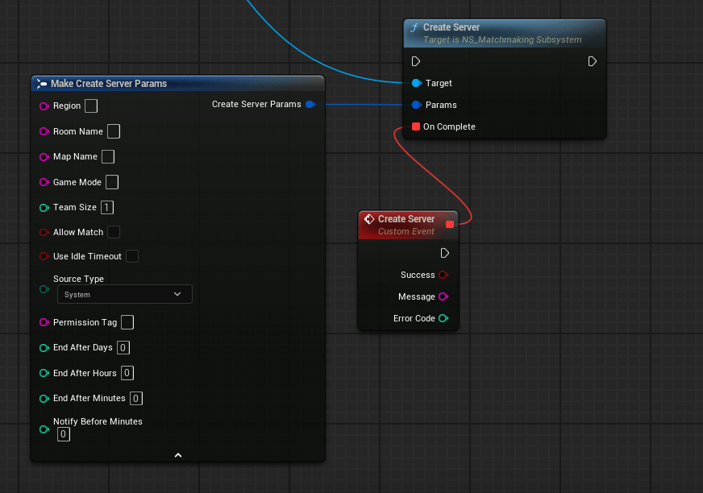

---

## 事件（Events）

所有事件均为可绑定的多播委托，在获取到的子系统实例上绑定即可。

### On Connection Success

玩家信息被服务端确认后触发（首次确认才触发，重连后的信息补发不会重复触发）。

| 参数 | 类型 | 说明 |
|------|------|------|
| Status | EConnectionStatus | Normal = 正常；Banned = 账号被封禁 |

### On Connection Lost

WebSocket 连接断开时触发（连接错误、被服务端关闭等情况）。触发后插件会按 `ReconnectAttempts` / `ReconnectDelay` 自动重连。

### On Kicked From Game

被服务端踢出时触发。

| 参数 | 类型 | 说明 |
|------|------|------|
| KickDataJson | String | 踢出数据的完整 JSON 字符串，可用 JSON 工具函数解析其中的原因等字段 |

### On Message Notification

收到服务端通知时触发，包含全局通知与「自定义操作」（Web 管理端向指定玩家下发的操作请求）。

| 参数 | 类型 | 说明 |
|------|------|------|
| EventName | String | 事件名；普通通知为空字符串 |
| Content | String | 通知内容 |

> 若通知中携带 `request_id`（自定义操作），插件会将其缓存，随后可调用 **Send Custom Operate Reply** 回复处理结果。

### On Match Result

匹配结果回调。

| 参数 | 类型 | 说明 |
|------|------|------|
| ServerAddress | String | 分配到的 DS 地址（IP:Port），错误时为空 |
| ErrorCode | Integer | `0` = 匹配成功；`1` = 暂无可用服务器（仍在匹配中）；其它 = 失败 |

### On Lobby Chat Message

收到大厅聊天消息时触发。

| 参数 | 类型 | 说明 |
|------|------|------|
| SenderName | String | 发送者名称 |
| Content | String | 消息内容 |

### On Room Chat Message

收到房间聊天消息时触发。

| 参数 | 类型 | 说明 |
|------|------|------|
| SenderName | String | 发送者名称 |
| Content | String | 消息内容 |

### On DS Shutdown

**DS 专用事件**。定时任务 / 手动创建的房间即将到期关闭时，服务端广播的关停倒计时通知。

| 参数 | 类型 | 说明 |
|------|------|------|
| RemainingSeconds | Integer | 距离关闭的剩余秒数 |

> 仅连接到子服务器的 DS 端会收到；玩家客户端不会收到该事件。可以用它做「服务器将在 N 秒后关闭」的 UI 提示与结算保存。

## JSON 工具函数库

`UNS_JsonUtilsBlueprintLibrary` 提供轻量 JSON 读写能力，常用于解析 `On Kicked From Game` 返回的 JSON 字符串。三个函数均为纯函数（无执行引脚），并且可在编辑器中调用。

### Extract JSON Value

从 JSON 字符串中按键取值并统一转为字符串。

| 参数 / 返回 | 类型 | 说明 |
|------|------|------|
| JsonString | String | 待解析的 JSON 字符串 |
| Key | String | 要取的键 |
| ReturnValue | String | 字符串原样返回；整数按 `%.0f`、小数按 `%.2f`；布尔返回 `true` / `false`；未找到返回空串 |

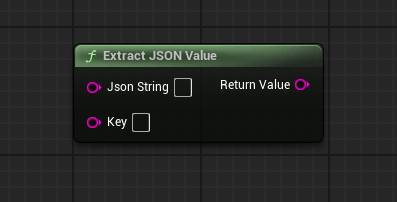

---

### JSON Has Key

判断 JSON 中是否存在指定键。

| 参数 / 返回 | 类型 | 说明 |
|------|------|------|
| JsonString | String | 待解析的 JSON 字符串 |
| Key | String | 要检查的键 |
| ReturnValue | Boolean | 存在返回 true |

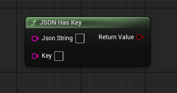

---

### Get JSON Keys

获取 JSON 对象的所有键。

| 参数 / 返回 | 类型 | 说明 |
|------|------|------|
| JsonString | String | 待解析的 JSON 字符串 |
| ReturnValue | String 数组 | 所有键的列表，解析失败或空串时返回空数组 |

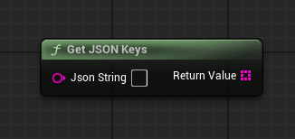

---

## 注意事项

1. **连接与认证**
   - 密码使用 MD5（`FMD5::HashAnsiString`）后发送，与服务端配置的密码 MD5 比对
   - 认证失败时服务端会主动断开，插件**不会重连**，请检查密码
   - `Is Connected` 的语义是「已连接 **且** 玩家信息已确认」，不要用它判断 WebSocket 是否已建立

2. **重连机制**
   - 连接错误或连接关闭时自动重连，间隔由 `ReconnectDelay` 控制，次数由 `ReconnectAttempts` 控制（`-1` 无限）
   - 重连成功后会自动补发玩家信息，并携带上次的房间 ID 与状态，用于恢复「游戏中」状态
   - 重连后 `On Connection Success` **不会**再次触发（仅首次确认时触发）

3. **角色校验**
   - 客户端专用节点在 DS / 监听服务器上调用会直接无效返回并输出警告日志
   - DS 专用节点在客户端调用同样无效返回
   - `DS Close Room` 仅允许纯 DS（`NM_DedicatedServer`）调用

4. **DS 端口与地址**
   - DS 端口来自启动命令行 `-port=`，由子服务器分配，不需要手动填写
   - DS 连接子服务器的地址固定为 `ws://127.0.0.1:8081/ws`（子服务器本地监听，无需认证）

5. **异步回调**
   - `Get Room List` / `Get Server Stats` / `Create Server` 使用 `request_id` 匹配回调，可并发调用
   - 回调不会因超时自动触发，服务端无响应时回调不会被调用

6. **其它**
   - 聊天消息有 0.5 秒发送间隔限流
   - 游戏实例销毁时，若玩家仍在房间中，插件会自动上报 `left_game` 状态
   - `Get Available Regions` 通过回调返回服务端实时下发的地区列表，并更新本地缓存，与 `master_config.json` 的 `available_regions` 保持一致
   - 服务端未下发 `allow_match` 字段时，`FRoomInfo.bAllowMatch` 保持默认 `true`
