# NS_HttpJson

## 插件简介

NS_HttpJson 是一套用于 **HTTP 网络通信与 JSON 数据加工** 的 UE 蓝图插件，通过一系列开箱即用的蓝图节点完成：

- HTTP 请求：支持 `GET` / `POST` / `PUT` / `DELETE` / `PATCH` 等请求方法，可自定义请求头（Header）与请求体（Post Data）
- 文件下载：支持下载进度反馈、保存路径控制、自动重命名与超时控制
- 文件上传：以 `multipart/form-data` 表单上传本地文件，支持额外表单字段与进度反馈
- JSON 解析：按 `Key` 或点语法 `Path` 提取字符串 / 整数 / 浮点数 / 布尔值 / 数组，兼容“字符串包裹的嵌套 JSON”
- JSON 构建与修改：`Map` / 数组一键序列化为 JSON，也可对已有 JSON 进行嵌套键值修改
- 结构体互转：自定义结构体与 JSON 相互转换，支持数组与 `FVector` / `FRotator` / `FTransform` 等常见类型

**模块信息**

<table class="ns-module-table">
  <thead>
    <tr><th>项目</th><th>值</th></tr>
  </thead>
  <tbody>
    <tr><td>模块名</td><td><code>NS_HttpJson</code></td></tr>
    <tr><td>模块类型</td><td>Runtime（加载阶段：PreLoadingScreen）</td></tr>
    <tr><td>依赖模块</td><td>Core、CoreUObject、Engine、Slate、SlateCore、HTTP、Json、JsonUtilities</td></tr>
    <tr><td>引擎版本</td><td>Unreal Engine 5.x（当前工程基于 UE 5.5）</td></tr>
    <tr><td>支持平台</td><td>Win64、Mac、iOS、Android、Linux</td></tr>
    <tr><td>核心类</td><td><code>UNS_HttpJsonAsyncAction</code>（HTTP 请求）、<code>UNS_FileUploadAsyncAction</code>（文件上传）、<code>UNS_FileDownloadAsyncAction</code>（文件下载）</td></tr>
    <tr><td>辅助类</td><td><code>UNS_HttpJsonBPLibrary</code>（JSON 工具函数库）</td></tr>
    <tr><td>蓝图分类</td><td>NS Http（请求 / 上传 / 下载）、NS Json（JSON 加工函数）</td></tr>
  </tbody>
</table>

> 所有 HTTP 相关节点都是 **异步动作（AsyncAction）**：调用后立即返回，结果通过输出执行引脚（`On Completed`、`On Progress`）异步回调，不会阻塞游戏线程。

## 枚举

### ENS_RequestType（请求类型）

`NS Send HTTP Request` 的请求方法选择项。

| 值 | 说明 |
|------|------|
| GET | 获取资源。`Post Data` 会作为查询参数拼接到 URL（如 `?a=1&b=2`） |
| POST | 提交数据。`Post Data` 会序列化为 JSON 请求体发送 |
| PUT | 整体更新资源。`Post Data` 会序列化为 JSON 请求体发送 |
| DELETE | 删除资源。`Post Data` 会作为查询参数拼接到 URL |
| PATCH | 局部更新资源。`Post Data` 会序列化为 JSON 请求体发送 |

## HTTP 请求节点

### NS Send HTTP Request【异步】

通用的 HTTP 请求节点，支持全部五种请求方法、自定义 Header 与请求体数据。

| 参数 | 类型 | 默认值 | 说明 |
|------|------|--------|------|
| URL | String | - | 目标 Web 服务器的完整地址，如 `https://api.example.com/data` |
| Request Type | ENS_RequestType | GET | 请求方法，见上表 |
| Header | Map\<String, String\> | 空 | 可选：自定义 HTTP 头，如 `Authorization`、`Accept` 等 |
| Post Data | Map\<String, String\> | 空 | GET / DELETE 时作为查询参数；POST / PUT / PATCH 时作为请求体数据 |
| Timeout | Float | 120.0 | 请求超时时间（秒），超过仍未完成则按失败处理 |

**输出（On Completed 之后）**

| 输出 | 类型 | 说明 |
|------|------|------|
| Response Json | String | 服务器返回的原始响应内容（通常为 JSON 字符串） |
| Response Code | Integer | 服务器返回的 HTTP 状态码（200 表示成功）；网络错误 / 超时 / 无响应时为 `0` |

**注意**

- `Post Data` 无需手动拼成 JSON 字符串：POST / PUT / PATCH 时插件会把 Map 序列化为 JSON 对象，并**自动设置 `Content-Type: application/json`**
- GET / DELETE 的 `Post Data` 按 `key=value&...` 直接拼接查询串，不会做 URL 编码，特殊字符请自行处理
- 响应失败或没有收到有效响应时，`Response Json` 为空字符串、`Response Code` 为 `0`，请以此判断请求是否真正成功
- 可安全地并发发起多个请求，每个动作节点独立回调

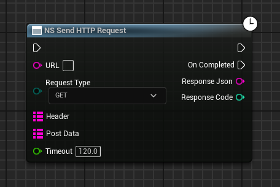

---

### NS Download File【异步】

从指定 URL 下载文件并保存到本地，支持进度反馈、相对路径与超时控制。

| 参数 | 类型 | 默认值 | 说明 |
|------|------|--------|------|
| Download URL | String | - | 文件的完整下载地址（HTTP / HTTPS） |
| Save Path | String | - | 保存到的**目录**。勾选相对路径时基于 `[项目]/Content/` 目录 |
| Is Relative Path | Boolean | true | true = `Save Path` 为相对路径；false = 绝对路径 |
| Timeout | Float | 120.0 | 下载超时时间（秒） |
| File Name Alias | String | 空 | 可选：替换下载文件的文件名；留空则使用 URL 中的原始文件名 |

**输出（On Completed 之后）**

| 输出 | 类型 | 说明 |
|------|------|------|
| Success | Boolean | 是否成功完成下载并写盘 |
| Saved File Path | String | 文件最终保存的完整路径 |
| File Name | String | 文件最终名称（可能已应用 Alias） |
| Progress Ratio | Float | 进度比率，完成时为 `1.0` |

**输出（On Progress 持续触发）**

| 输出 | 类型 | 说明 |
|------|------|------|
| Progress Ratio | Float | 当前下载进度比率（0.0 ~ 1.0） |
| Bytes Received | Integer64 | 已接收字节数 |
| Total Bytes | Integer64 | 总字节数；服务器未返回 `Content-Length` 时为 `-1`（此时进度为估算值） |

**注意**

- 文件名默认取自 URL 路径最后一段（自动去掉查询参数）；URL 末尾无文件名时使用 `downloaded_file`
- `File Name Alias` 只替换主文件名、**保留原扩展名**（例如 `a.zip` 传入 Alias=`my` 结果为 `my.zip`）；原文件无扩展名时直接使用 Alias
- 保存目录不存在时插件会自动创建（包括多级目录）
- 与上传不同，下载**只判断是否收到有效响应**，不校验状态码是否为 2xx，服务器返回 404 / 500 时其响应体也会被保存，请自行按业务校验
- 文件会先整体缓存在内存中再写盘，不适合下载超大文件

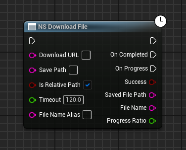

---

### NS Upload File【异步】

以 `multipart/form-data` 表单上传本地文件，支持进度跟踪、自定义 Header 与额外表单字段。

| 参数 | 类型 | 默认值 | 说明 |
|------|------|--------|------|
| Upload URL | String | - | 服务器接收上传的接口地址 |
| File Path | String | - | 待上传的本地文件路径；相对路径基于 `[项目]/Content/` 目录 |
| File Field Name | String | 空 | 文件对应的表单字段名；留空默认 `file` |
| Header | Map\<String, String\> | 空 | 可选：自定义 HTTP 头（如认证 Token） |
| Post Data | Map\<String, String\> | 空 | 可选：随请求一同发送的**额外表单字段**（如用户 ID、文件描述），会先于文件字段写入 |
| Is Relative Path | Boolean | true | true = `File Path` 为相对路径；false = 绝对路径 |
| Timeout | Float | 120.0 | 上传超时时间（秒） |

**输出（On Completed 之后）**

| 输出 | 类型 | 说明 |
|------|------|------|
| Success | Boolean | 是否上传成功（响应状态码为 2xx） |
| Response Content | String | 服务器返回的原始响应内容（通常是 JSON 反馈） |
| Response Code | Integer | 服务器返回的 HTTP 状态码 |
| Progress Ratio | Float | 进度比率，完成时为 `1.0` |

**输出（On Progress 持续触发）**

| 输出 | 类型 | 说明 |
|------|------|------|
| Progress Ratio | Float | 当前上传进度比率（0.0 ~ 1.0） |
| Bytes Sent | Integer64 | 已发送字节数 |
| Total Bytes | Integer64 | 上传总字节数 |

**注意**

- 与下载不同，上传**只有服务器返回 2xx 状态码才视为成功**，否则 `Success = false`，`Response Content` 为服务器返回的错误信息
- 文件不存在或读取失败时会立即回调：`Success = false`、`Response Code = 0`，并在 `Response Content` 中给出原因（如 `File not found: xxx`）
- 文件字段的 `Content-Type` 固定为 `application/octet-stream`，Content-Type 边界由插件自动生成
- 上传方法固定为 `POST`

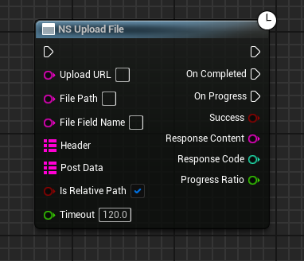

## JSON 读取节点

JSON 读取节点全部是**纯函数（无执行引脚）**，可在蓝图中直接作为取值节点使用。传入包含 JSON 的字符串即可得到结果。

按取值方式分为两类：

- **Value 系列**：从 JSON **最外层对象**中按 `Key` 取值，适合单层结构
- **Path 系列**：按点语法 `Path`（如 `user.info.name`）直接深入到任意层级的嵌套字段

> 两类都兼容“字符串中包裹 JSON”的常见情况，即字段值本身是 `"{...}"` / `"[...]"` 形式的字符串时也能继续解析。

### NS Json Value To String / Int / Float / Bool

根据 `Key` 从 JSON 对象中提取对应值，并转换为指定类型。

**通用输入**

| 参数 | 类型 | 说明 |
|------|------|------|
| Json String | String | 待解析的 JSON 字符串（通常接自 `NS Send HTTP Request` 的 `Response Json`） |
| Key | String | 目标键名。仅匹配最外层，例如 `{"user_id": 123}` 取 `user_id` |

**返回值**

| 节点 | 返回类型 | 说明 |
|------|---------|------|
| NS Json Value To String | String | 字符串原样返回；数字 / 布尔转为字符串；对象 / 数组转为紧凑 JSON 字符串 |
| NS Json Value To Int | Integer | 数字取整返回 |
| NS Json Value To Float | Float | 数字返回 |
| NS Json Value To Bool | Boolean | 布尔返回 |

**注意**：找不到键、JSON 解析失败或类型不匹配时，String 返回空串、Int 返回 `0`、Float 返回 `0.0`、Bool 返回 `false`。

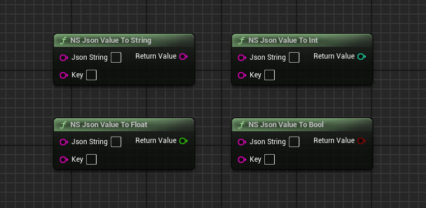

---

### NS Json Path To String / Int / Float / Bool

JSON 深层数据提取：使用点语法 `Path` 直接访问嵌套结构，无需多步解析。

**通用输入**

| 参数 | 类型 | 说明 |
|------|------|------|
| Json String | String | 待解析的 JSON 字符串 |
| Path | String | 点语法路径。例如从 `{"user":{"info":{"name":"Test"}}}` 取名字，Path 填 `user.info.name` |

**返回值** 与 Value 系列相同（String / Int / Float / Bool），取值类型按使用节点而定。

**注意**：路径中任意一段不存在、不是对象或无法继续深入时，返回对应类型的默认值（`""` / `0` / `0.0` / `false`）；路径支持穿透“字符串包裹的 JSON 对象”。

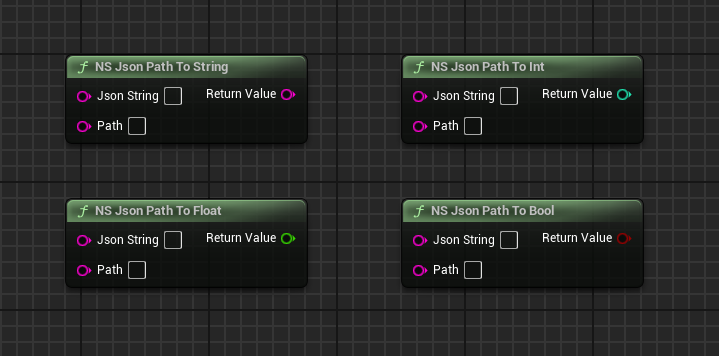

---

### NS Json Value / Path To Array

把 JSON 数组提取为蓝图数组变量，共有 6 个节点：

| 节点 | 输入 | 返回类型 |
|------|------|---------|
| NS Json Value To Array (String) | Json String + Key | String 数组 |
| NS Json Value To Array (Int) | Json String + Key | Integer 数组 |
| NS Json Value To Array (Float) | Json String + Key | Float 数组 |
| NS Json Path To Array (String) | Json String + Path | String 数组 |
| NS Json Path To Array (Int) | Json String + Path | Integer 数组 |
| NS Json Path To Array (Float) | Json String + Path | Float 数组 |

**说明**

- 兼容目标值是真正的数组（`"scores":[10,20,30]`），也兼容字符串形式的数组（`"scores":"[10,20,30]"`）
- 元素会自动做类型转换：例如 Int 数组会把数字、字符串（`Atoi`）、布尔（true=1）统一转为整数
- Key / Path 不存在、不是数组或类型转换失败时返回**空数组**（不会报错）

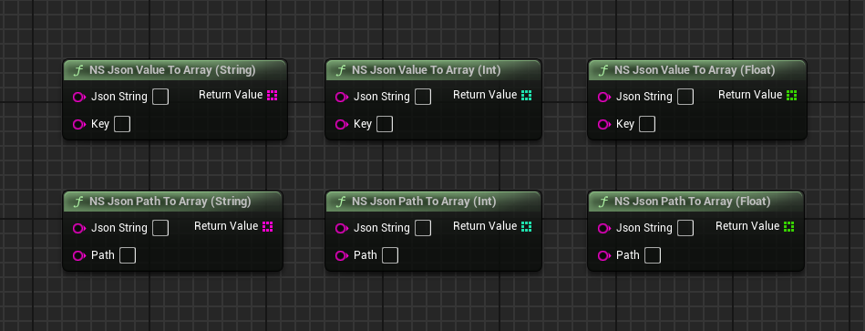

## JSON 构建节点

### NS Map To Json

把蓝图中的 `Map<String, String>` 序列化为 JSON 对象字符串，是构建 HTTP 请求体的核心工具。

| 参数 / 返回 | 类型 | 说明 |
|------|------|------|
| Map | Map\<String, String\> | Map 的 Key 成为 JSON 字段名，Value 成为字段值 |
| Return Value | String | 序列化后的 JSON 字符串 |

**自动嵌套规则**

Map 的 Value 若本身是合法的 `{...}` 对象或 `[...]` 数组文本，会自动被解析为嵌套的对象 / 数组；否则作为普通字符串值。

例如把 **NS Int Array To Json** 的输出（`[10,20,30]`）作为 Map 的某个 Value，最终会生成 `{"user_id":"101","scores":[10,20,30]}` 这样的嵌套 JSON。

> 由于 `TMap` 底层无序，输出 JSON 的**字段顺序不保证与添加顺序一致**，请勿依赖字段顺序（JSON 语义本身也不依赖顺序）。

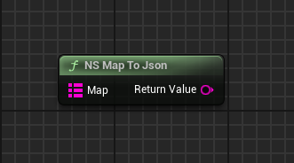

---

### NS String / Int / Float Array To Json

把蓝图基本类型数组快速序列化为 JSON 数组字符串，共 3 个节点：

| 节点 | 输入类型 | 返回 | 示例输出 |
|------|---------|------|---------|
| NS String Array To Json | String 数组 | String | `["item1","item2"]` |
| NS Int Array To Json | Integer 数组 | String | `[10,20,30]` |
| NS Float Array To Json | Float 数组 | String | `[1.5,2.5]` |

**说明**：String 数组中元素若为 `{...}` / `[...]` 文本同样会被解析为嵌套对象 / 数组；序列化结果常作为子值（字符串）塞进 **NS Map To Json** 的 Map，用于构建复杂请求体。

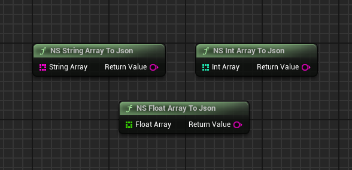

---

### NS Json Array To String Array

把**不含键名的纯数组字符串**整体转换为 String 数组，用于处理服务器返回的 `["key1","key2",...]` 这类特殊接口。

| 参数 / 返回 | 类型 | 说明 |
|------|------|------|
| Json Array String | String | 必须是 `[` `]` 包裹的有效 JSON 数组字符串，如 `["apple","banana"]` |
| Return Value | String 数组 | 转换后的字符串数组 |

**说明**：数组元素为数字、布尔、嵌套对象 / 数组时会一并转为字符串；输入完全无法解析时把原始输入作为单个元素返回。

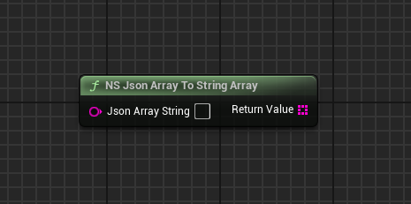

## JSON 修改节点

### NS Set Json Value (String / Int / Float / Bool)

在已有 JSON 中设置（新增或覆盖）一个字段值，返回修改后的完整 JSON 字符串。共 4 个节点，按 Value 参数类型区分。

| 参数 | 类型 | 说明 |
|------|------|------|
| Json String | String | 原始 JSON 字符串 |
| Key | String | 字段键，**支持点语法路径**，如 `data.name` 表示修改嵌套字段 |
| Value | String / Integer / Float / Boolean | 要写入的值，按节点类型而定 |
| Return Value | String | 修改后的完整 JSON 字符串 |

**注意**

- `Key` 支持点号路径：路径上的中间节点不存在时**自动创建为对象**；中间节点是“字符串包裹的 JSON”时会先解析、修改后再回写为字符串
- JSON 解析失败时原样返回输入的 `Json String`，不会丢失数据

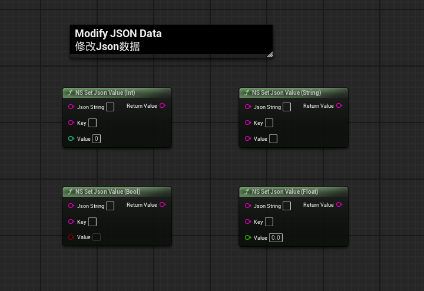

## 结构体转换节点

结构体（Struct）与 JSON 互转节点基于反射实现，可配合 HTTP 响应做“JSON → 结构体变量”的强类型读取。

节点共 4 个，按**转换方向**分为两组：

- **解析方向（JSON → 结构体）**：把 JSON 填充进结构体变量 —— `NS Json To Struct`（单个对象）、`NS Json To Struct Array`（对象数组）
- **序列化方向（结构体 → JSON）**：把结构体变量输出为 JSON 字符串 —— `NS Struct To Json`（单个结构体）、`NS Struct Array To Json`（结构体数组）

两个方向共用同一套反射规则：

- 字段名按结构体在编辑器中显示的名字匹配（区分大小写），JSON 中不存在对应字段的属性保持原值
- 支持 Bool / Int / Int64 / Float / String、嵌套结构体、一维基础数组，并额外支持 `FVector` / `FRotator` / `FTransform`

### 解析方向：JSON → 结构体

将服务器返回的 JSON 直接解析到结构体变量中，避免逐字段取值。这两个节点都**按引用直接修改目标变量（有执行引脚）**；JSON 无效或字段缺失时保持原数据不变，可放心用于容错读取。

#### NS Json To Struct

把单个 JSON 对象字符串按字段名填充到结构体变量中。

| 参数 | 类型 | 说明 |
|------|------|------|
| Json String | String | 待解析的 JSON 对象字符串 |
| In Out Struct | 任意结构体 | 目标结构体变量，调用后被填充 |

> `FVector` / `FRotator` / `FTransform` 在 JSON 中可以是对象形式（`{X,Y,Z}` / `{Pitch,Yaw,Roll}`），也可以是 UE 字符串形式。

#### NS Json To Struct Array

把 JSON 数组字符串解析并填充到结构体数组变量中。

| 参数 | 类型 | 说明 |
|------|------|------|
| Json String | String | 待解析的 JSON 数组字符串 |
| In Out Struct Array | 结构体数组 | 目标结构体数组变量，调用后被填充 |

> 数组元素既可以是 JSON 对象，也可以是字符串形式的 JSON 对象；解析失败时数组保持不变。

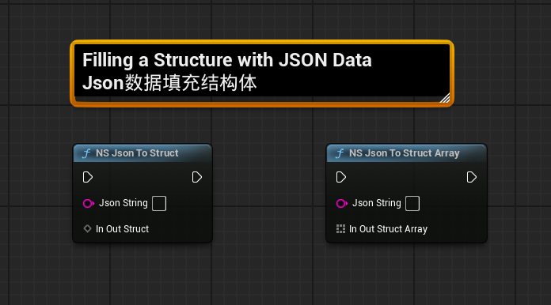

---

### 序列化方向：结构体 → JSON

把结构体变量整体序列化为 JSON，常用于上传数据前把配置 / 结果对象打包成请求体。这两个节点均为**纯函数**。序列化失败时分别返回 `{}` / `[]`。

#### NS Struct To Json

把单个结构体序列化为 JSON 对象字符串。

| 参数 / 返回 | 类型 | 说明 |
|------|------|------|
| In Struct | 任意结构体 | 待序列化的结构体变量 |
| Return Value | String | JSON 字符串；序列化失败时返回 `{}` |

> `FVector` / `FRotator` / `FTransform` 会以 UE 的 `ToString` 字符串形式输出；嵌套结构体输出为 JSON 对象。

#### NS Struct Array To Json

把结构体数组序列化为 JSON 数组字符串。

| 参数 / 返回 | 类型 | 说明 |
|------|------|------|
| In Struct Array | 结构体数组 | 元素必须是结构体 |
| Return Value | String | JSON 数组字符串；序列化失败时返回 `[]` |

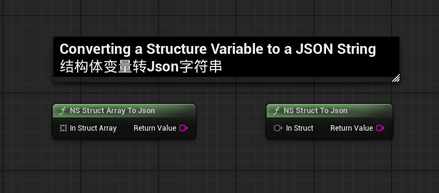

## 注意事项

1. **请求与回调**
   - `NS Send HTTP Request` 对成功 / 失败**只回调一次**：收到有效响应即回调并携带状态码，网络错误 / 超时则以空响应、状态码 `0` 回调
   - 上传成功以上传 `2xx` 状态码为准；下载只判断“是否收到响应体”，不校验状态码
   - 三个 HTTP 节点均为异步动作，内部注册到 GameInstance，可安全并发调用

2. **Post Data / 请求体**
   - GET / DELETE 的 `Post Data` 会拼成查询字符串（URL 已带 `?` 时自动追加 `&`），**不做 URL 编码**
   - POST / PUT / PATCH 的 `Post Data` 会序列化为 JSON 请求体，并自动写入 `Content-Type: application/json`（会覆盖 Header 中同名的预设值）

3. **路径含义**
   - 上传 / 下载勾选 `Is Relative Path` 时，`File Path` / `Save Path` 均相对于 `[项目]/Content/` 目录（`ProjectContentDir`）
   - 下载的 `Save Path` 指保存**目录**（目录不存在会自动创建），文件名由 URL 或 `File Name Alias` 决定

4. **JSON 提取**
   - `NS Json Value To X` 只查最外层键，`NS Json Path To X` 用点语法查深层；两者都兼容“字符串包裹 JSON”的数据
   - 提取失败不报错：String 返回空串、Int 返回 `0`、Float 返回 `0.0`、Bool 返回 `false`、数组返回空数组，请先自行确认字段存在

5. **Map 转 JSON**
   - `TMap` 无序，`NS Map To Json` 输出的字段顺序不定；依赖顺序的服务端请改用结构体转换节点
   - 借助 `[Type] Array To Json` 生成数组文本作为 Map 的 Value，再经 `NS Map To Json` 即可构建嵌套结构，这是组装复杂请求体的推荐姿势

6. **结构体转换**
   - 字段名匹配编辑器中显示的名字，区分大小写；结构体建议使用 `BlueprintType` 以支持变量创建
   - `NS Json To Struct` / `NS Json To Struct Array` 在 JSON 解析失败时保持原数据不变，可放心用于容错读取
